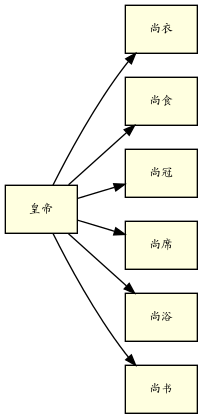
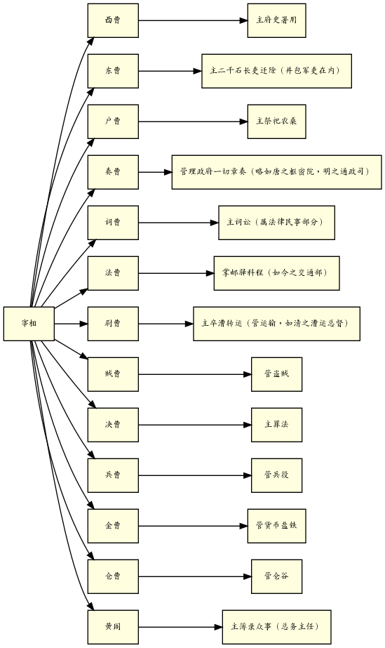
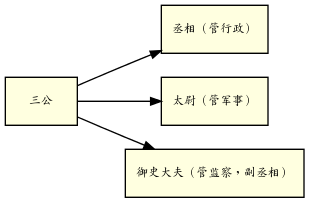
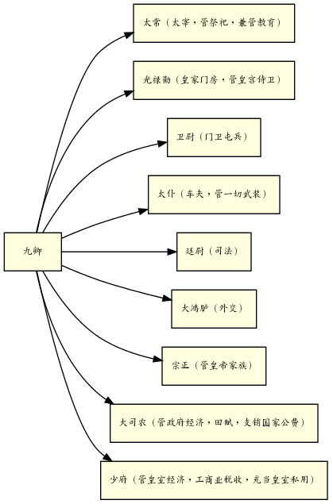
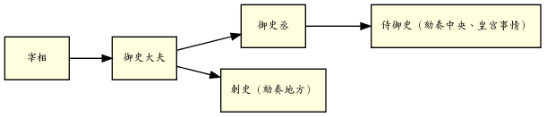
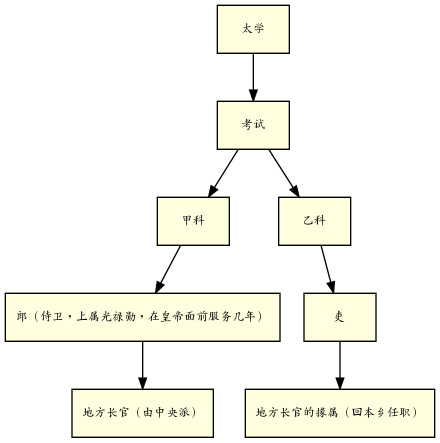

## 目录

- [汉代政府组织](#汉代政府组织)
  - [皇室与政府](#皇室与政府)
  - [中央政府的组织](#中央政府的组织)
  - [汉代地方政府](#汉代地方政府)
  - [中央与地方之关系](#中央与地方之关系)
- [汉代选举制度](#汉代选举制度)
- [汉代经济制度](#汉代经济制度)
- [汉代兵役制度](#汉代兵役制度)

## 汉代政府组织
### 皇室与政府
>严格说来，要到秦汉才是中国历史上正式有统一政府。

主要指的是中央与地方的关系。
秦以前主要是诸侯分封，各国各自为政，
书不同文，车不同轨，也不使用同样的历法，
更不用说税收、官员委派等政治经济制度了。

秦一统后，地方以郡县分治，由中央统一管理，
全国基本有统一的经济、政治制度。
故此时才算有统一政府。

>秦代只是汉代之开始，汉代大体是秦代之延续。
所以秦代暂亦不讲，而只讲汉代。

>我们要看政府的组织，最重要的是看政府的职权分配。
在此方面，我亦只是想提出两点来加以申说。
第一是皇室与政府之职权划分，
第二是中央与地方的职权划分。

#### 皇帝是国家的元首
>皇位是世袭的——父亲传给儿子。

中国的立国体制和西方历史上的希腊、罗马不同。

希腊一国只一城市规模，人众才几万，其领袖自可由市民选举。
罗马开始也只是一城市，后来向外征服，形成帝国。
但其中央核心，还是希腊城邦型的。

中国秦汉时，国土便已和现在差不多，户口亦至少在几千万以上。
且中国是一个农业国，人众分散在全国几千万个农村。
民选是不可能的事。
皇位世袭，也是一稳定可行之法。

>但从秦汉以后，封建制度早已推翻。
单只皇室一家是世袭的，除却皇帝可以把皇位传给他儿子以外，
政府里便没有第二个职位，第二个家庭，可以照样承袭。

郡太守与县令的职位都不是可世袭的。

#### 宰相是政府的领袖
>皇室是不是即算政府？若把皇室和政府划开，这两边的职权又怎样分？

皇帝是国家的唯一领袖，而实际政权则不在皇室而在政府。
代表政府的是宰相，负政治上一切实际的责任。

>拿历史大趋势来看，可说中国人一向意见，
皇室和政府是应该分开的，而且也确实在依照此原则而演进。

#### 皇帝与宰相职权划分
前五尚都只管皇帝私人的衣服起食饮居。
只有尚书是管文书的。汉代开始的尚书，其职权地位本不高，后来才愈弄愈大。

朝廷一切官吏任免升降，都要经宰相的秘书处。

### 中央政府的组织

#### 三公
>丞相管行政，是文官首长；
太尉管军事，是武官首长；
御史大夫管监察，辅助丞相来监察一切政治设施。
它是副丞相。

>按照汉代习惯，...，须做了御史大夫，才得升任为丞相。
太尉虽与丞相尊位相等，实际除却军事外，不预闻其他政事。
因此当时最高行政长官实在是丞相。

“丞”与“相”均是“副”的意思，即皇帝的副官。
>皇帝实际上不能管理一切事，所以由宰相来代理，皇帝可以不负责任。

封建时代，贵族家庭最重要事在祭祀。
“宰”，指祭祀宰杀牲牛。

>象征这一意义，当时替天子诸侯乃及一切贵族公卿的都称宰。

到了秦汉统一，化家为国，皇帝家的宰也就成了国家的政治领袖。

宰相既要管政府事，又要管皇帝家事，忙不过来，
>于是在御史大夫，即副丞相之下，
设有一个御史中丞，他便是御史大夫的副。

御史中丞住在皇宫，皇室一切事均由御史中丞管。
御史中丞属于御史大夫，御史大夫又隶属于宰相，
如此实则皇室一切事仍得由宰相管。

>那时，皇帝有什么事，交待御史中丞，
御史中丞报告御史大夫，御史大夫再转报宰相。
宰相有什么事，也照这个手续，由御史大夫转中丞，
再转入内廷，这是当时皇帝与政府关系之大概。

#### 九卿
九卿统属于宰相，其官位都是二千石，又称中二千石。
以示区别于郡太守地方行政首长之亦是二千石。

年俸二千石谷的官称二千石，是当时最大的官。

>大司农管的是政府经济，少府管的是皇室经济。
大司农的收入支销国家公费，少府收入充当皇室私用。
皇室不能用大司农的钱。
所以我们说当时皇室和政府在法理上是鲜明划分的。

>当时全国田赋收入是大宗，由大司农管。
工商业的税收，譬如海边的盐，山里的矿，原来收入很少，由少府管。

### 汉代地方政府
汉代地方政府分郡、县两级。
大体上汉代有一百多个郡，一个郡管十个到二十个县。
大概汉代的县数在一千一百到一千四百之间。

>中国历史上讲到地方行政，一向推崇汉朝，
所谓两汉吏治，永为后世称美

郡长官称太守，地位和九卿平等，也是二千石。

郡太守调到中央可以做九卿，再进一级就可当三公，
九卿放出来也做郡太守。

>汉代官级分得少，升转极灵活，这又是汉制和后来极大的不同。

### 中央与地方之关系

>每郡每年要向中央上计簿，计簿就是各项统计表册，也就是地方的行政成绩。

>中央特派专员到地方来调查的叫刺史。

全国分为十三个调查区，每一区派一个刺史，
平均一个刺史的调查区域，不会超过九个郡。
他的调查项目也有限制，政府规定根据六条考察，六条以外，也就不多管。

地方实际行政责任，是由太守负责的。
太守官俸二千石，而刺史只是俸给六百石的小官。

刺史上属于御史丞。
皇宫里还有十五个侍御史，专事劾奏中央乃及皇宫里的一切事情。
刺史与侍御史的意见都报告到御史大夫，御史大夫再报给宰相。

## 汉代选举制度

古代封建世袭，天子之子为天子，公之子为公，
卿之子为卿，大夫之子为大夫，做官人有一定的血统，
不存在选举的问题。

秦汉时便已废弃封建世袭制度，故需要一套制度来决定何人做官。

### 郎吏辟用

三公、九卿、郡太守、县令，由皇帝通过中央政府任命。
其他官员则由长官自己任命。
譬如宰相下面的十三曹，便由宰相自己辟用。

### 乡举里选

大体分三种。

#### 无定期的
如老皇帝死了，新皇帝即位，往往下诏希望各地选举人才到中央。
如大荒年，大水灾，或是大瘟疫，也下诏希望地方推举贤人。

此种选举出来的多半称为贤良。
贤良到中央需要对策，政府从中挑选任用。

#### 特殊选举

如政府需要派人出使绝域，便下诏征求。
又如军队要用军事人才，或如黄河决口，需要晓习治水的人。

可推举，亦可自荐。

#### 选举孝廉
汉代一向有诏令地方察举孝子廉吏，但地方政府有时不太在意，应选人也不踊跃。
武帝曾下令公议，不举孝子廉吏的地方长官应如何处罚。
此后便无形中成了一种有定期的选举，每郡每年都要举出一个两个孝子廉吏来塞责。

## 汉代经济制度

## 汉代兵役制度
